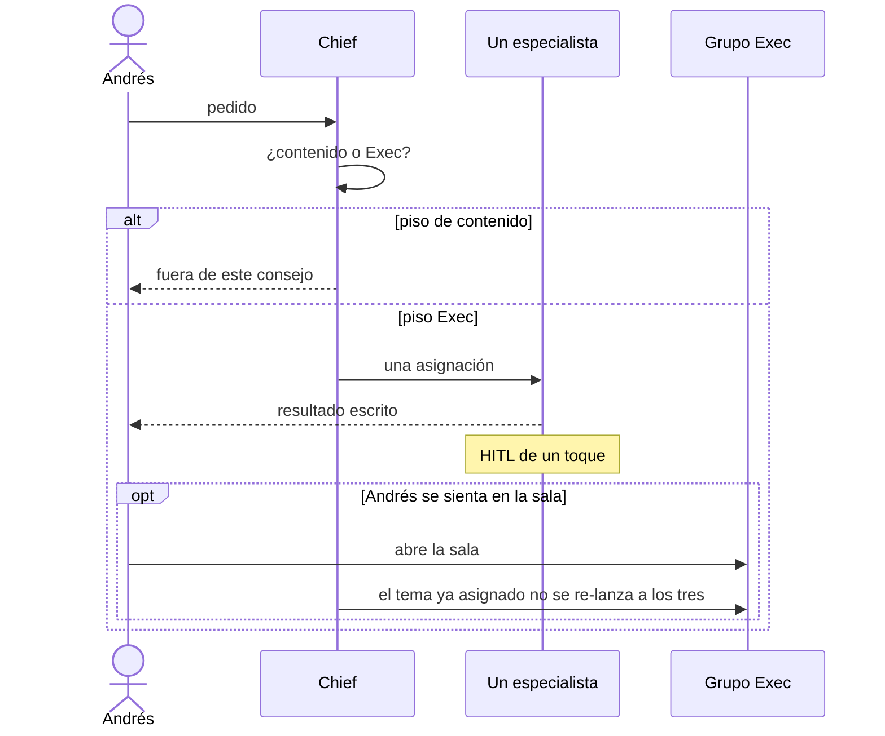

# Routing

Cómo entra un pedido y a quién le toca. Chief enruta. El grupo Exec no es el buzón.

## Dos pisos

| Piso | Para qué | Este consejo |
|---|---|---|
| **Contenido** (ya en vivo) | Research, Social Trends, Idea Filter, Social Pack, Campaigns | No. No reemplazar. |
| **Exec** (este repo) | Apuestas del portafolio, caja, MVP | Sí, vía Chief. |

### Piso de contenido — no absorber

- **Research** — semilla → brief de ventaja práctica.
- **Social Trends** — dos carriles sin mezclar: guitarra (TikTok/IG) vs tesis LinkedIn.
- **Idea Filter** — inbox de ideas: artículo+post / post / no.
- **Social Pack** — estado Ready → pack de design system. No publica.
- **Campaigns** — solo IRC Abogados; Jessica lidera. Fuera de Exec.

Si el pedido es copy, carril social, pack de diseño o campaña IRC → no es CSO / CFO / CPO. Chief lo manda al piso de contenido (o lo rechaza si es Campaigns y no eres Jessica).

### Piso Exec — sí

- Qué apuesta vive o muere, OKR trimestral de portafolio → **CSO**
- Caja, unit economics, FinOps personal, spend de tools → **CFO**
- Qué entra o sale del MVP (Sophieat; andres-maldonado.com como superficie) → **CPO**

## Por defecto

Una asignación, un especialista. No despiertes a los tres vivos sobre el mismo tema.

El grupo **Exec** (`19b3438c-6870-4d5f-8bd2-5eb2cb6b9d9c`) es la sala del consejo. Se usa cuando Andrés se sienta ahí (conflicto entre asientos, revisión conjunta, o él lo pide). No es el router.

Asientos de papel (CHRO, GC, COO, CMO, Board): Chief no los “despierta”. Puede citar la spec. Instanciar bot = cambio de roster, no de un chat.

## Secuencia (por defecto)

Andrés → Chief → un especialista. El grupo Exec no interviene salvo que Andrés entre a la sala.

## Cortes rápidos

| Señal | Destino |
|---|---|
| TikTok/IG guitarra, LinkedIn tesis, pack, idea de post | Piso de contenido |
| Campaña IRC / Jessica | Campaigns — no Exec |
| Código (Claude Code / Opus) | Fuera de CPO y de este piso |
| WOM como empleador | Fuera (combustible, no identidad) |
| Apuesta / OKR / portafolio (Sophieat, activos, doctorado, escuela, comunidad) | CSO |
| Caja, tools (Cursor Ultra, Claude), autopista, Scotiabank, arriendo | CFO |
| Scope de MVP Sophieat o superficie andres-maldonado.com | CPO |
| Contratar, cultura, compensación (sin trabajo semanal aún) | CHRO papel — no instanciar |
| Contrato, IP, compliance básico (no eres el abogado de IRC) | GC papel — no instanciar |
| Ops de casa más allá del charter | COO papel — no instanciar todavía |
| GTM de empresa distinto de @devandmus | CMO papel — nunca clon del piso social |
| Fundraising / deck de inversionistas | Board papel — solo si arranca fundraising |
| Conflicto entre asientos y Andrés quiere la sala | Grupo Exec |
