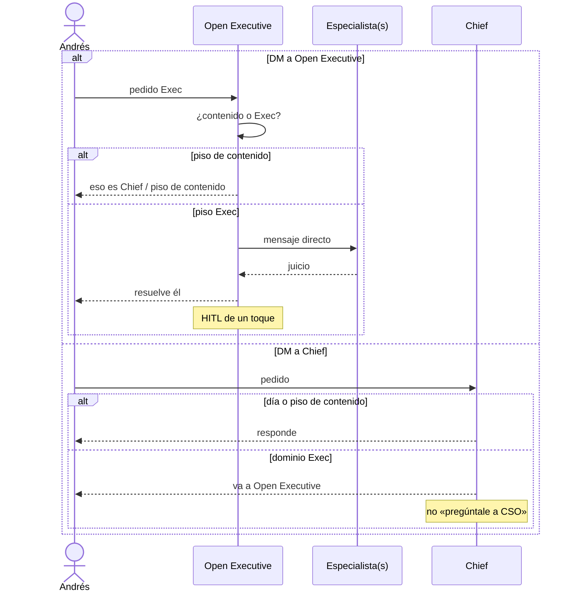

# Routing

Cómo entra un pedido y a quién le toca. Andrés opera solo con el agente de entrada. Ese agente invoca especialistas por mensaje directo y resuelve él.

## Dos pisos

| Piso | Para qué | Este consejo |
|---|---|---|
| **Contenido** (ya en vivo) | Research, Social Trends, Idea Filter, Social Pack, Campaigns | No. No reemplazar. Vía **Chief**. |
| **Exec** (este repo) | Apuestas del portafolio, caja, MVP, ops, gente, legal básico, GTM de compañía, board | Sí, vía **Open Executive**. |

No hay tercera vía. El canal **Exec** (`19b3438c-6870-4d5f-8bd2-5eb2cb6b9d9c`) está **inerte**. No publiques ahí. Andrés lo quitará de la barra.

### Piso de contenido — no absorber

- **Research** — semilla → brief de ventaja práctica.
- **Social Trends** — dos carriles sin mezclar: guitarra (TikTok/IG) vs tesis LinkedIn.
- **Idea Filter** — inbox de ideas: artículo+post / post / no.
- **Social Pack** — estado Ready → pack de design system. No publica.
- **Campaigns** — solo IRC Abogados; Jessica lidera. Fuera de Exec.

Si el pedido es copy, carril social, pack de diseño o campaña IRC → no es el enjambre Exec. **Chief** lo atiende (o lo rechaza si es Campaigns y no eres Jessica). **CMO** no toca ese pipeline.

### Piso Exec — sí, vía Open Executive

- Qué apuesta vive o muere, OKR trimestral de portafolio → **CSO**
- Caja, unit economics, FinOps personal, spend de tools → **CFO**
- Qué entra o sale del MVP (Sophieat; andres-maldonado.com como superficie) → **CPO**
- Ops y procesos del portafolio (más allá del día de casa) → **COO**
- Hiring, compensación, cultura (cuando hay un pedido de gente) → **Chief People Officer**
- Contrato, IP, compliance básico (no eres el abogado de IRC) → **General Counsel**
- GTM / marca / PR de Sophieat u otra compañía → **CMO**
- Gobierno / inversionistas (no hay ronda activa) → **Board**

Open Executive elige a quién invocar. Puede ser uno o más. Andrés no va de puerta en puerta.

## Por defecto

Andrés → **Open Executive** → mensaje directo a especialista(s) → **Open Executive** resuelve.

Nunca «pregúntale a CSO». Nunca un grupo de debate.

Si Andrés escribe a **Chief** y el tema es dominio Exec, Chief lo entrega a **Open Executive**. No dice «pregúntale a CSO».

## Secuencia

No hay rama “sala Exec”. Ese canal no se usa.

## Cortes rápidos

| Señal | Destino |
|---|---|
| TikTok/IG guitarra, LinkedIn tesis, pack, idea de post | Piso de contenido (Chief) |
| Campaña IRC / Jessica | Campaigns — no Exec |
| Código (Claude Code / Opus) | Fuera de CPO y de este piso |
| WOM como empleador | Fuera (combustible, no identidad) |
| Apuesta / OKR / portafolio (Sophieat, activos, doctorado, escuela, comunidad) | Open Executive → CSO |
| Caja, tools (Cursor Ultra, Claude), autopista, Scotiabank, arriendo | Open Executive → CFO |
| Scope de MVP Sophieat o superficie andres-maldonado.com | Open Executive → CPO |
| Ops de portafolio más allá del día de casa | Open Executive → COO |
| Contratar, cultura, compensación | Open Executive → Chief People Officer |
| Contrato, IP, compliance básico (no eres el abogado de IRC) | Open Executive → General Counsel |
| GTM de empresa distinto de @devandmus | Open Executive → CMO (nunca clon del piso social) |
| Fundraising / deck de inversionistas | Open Executive → Board (no hay ronda activa) |
| Canal Exec | Inerte. No usar. Andrés lo quitará de la barra. |
